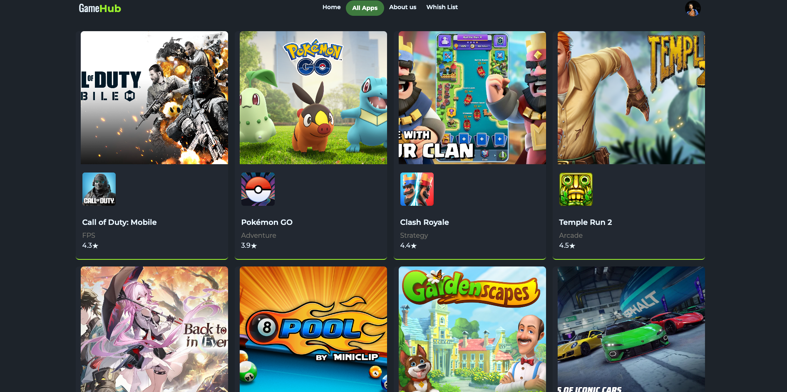
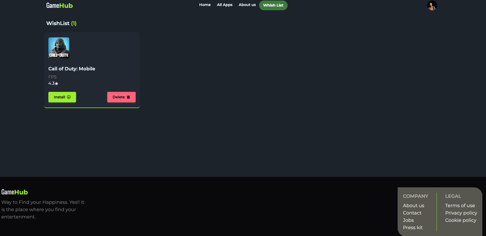

## Project Name: Game Hub
**Purpose:** Game Hub is collection of all your favorite games. Here you will find top most game for your entertainment.You can look forword to those game. And can easily install them and made your time more enjoyable.

**Key features:** Find your all favorite games in one place.

---
**npm packages:** react,tailwindcss,daisy Ui,swiperjs,react-icons,motion etc.## Project Name: Game Hub

---

 

---

### Purpose:
 Game Hub is collection of all your favorite games. Here you will find top most game for your entertainment.You can look forword to those game. And can easily install them and made your time more enjoyable.

---- 

### Key features:
- Find your all favorite games in one place.
- Install game easly.
- See game Details.
- Add your favorite game to wishlist.

---

### Technologies Used
Frontend: React.js
Backend: Node.js, Express.js
Authentication: firebase
Database: mongodb
Styling: Tailwind CSS
Deployment: firebase (Frontend)

### Dependences 
To initialze the app you have to added firebase auth in an .env file.